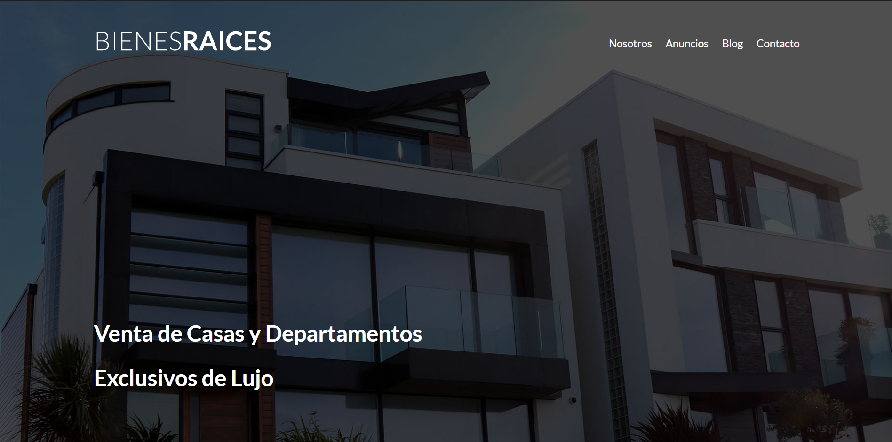

# Bienes Raíces

## Proyecto Visual

Este es un proyecto de práctica para habilidades de diseño web, en este solo se utiliza HTML y CSS, no utilizo JavaScript ni PHP, es más que nada para desarrollar la parte visual responsiva tanto para computadoras, laptop y dispositivos móviles.

Realicé el deploy de la página con netlify, y se encuentra alojada en el siguiente link:

